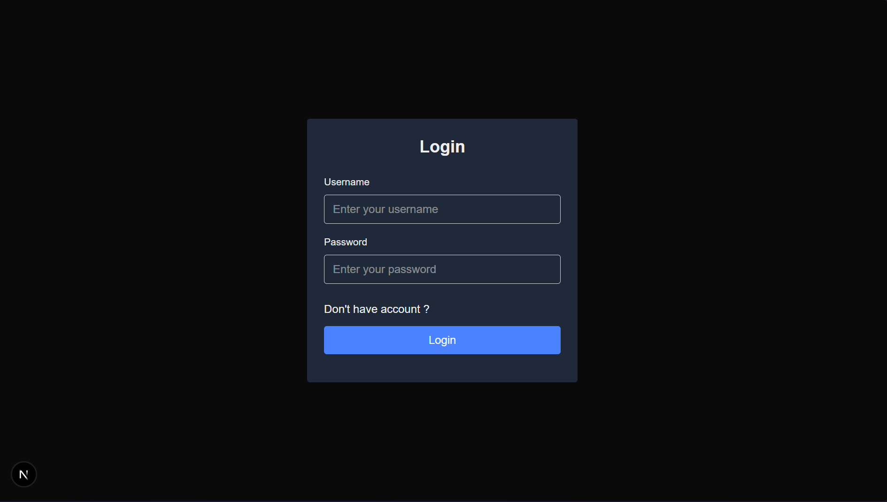
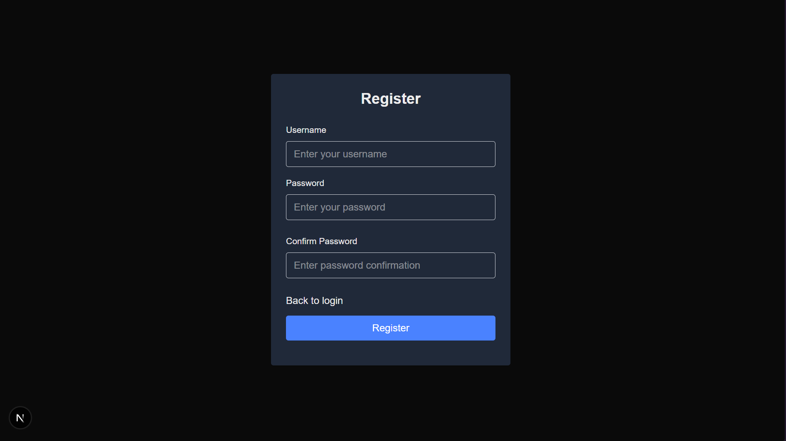
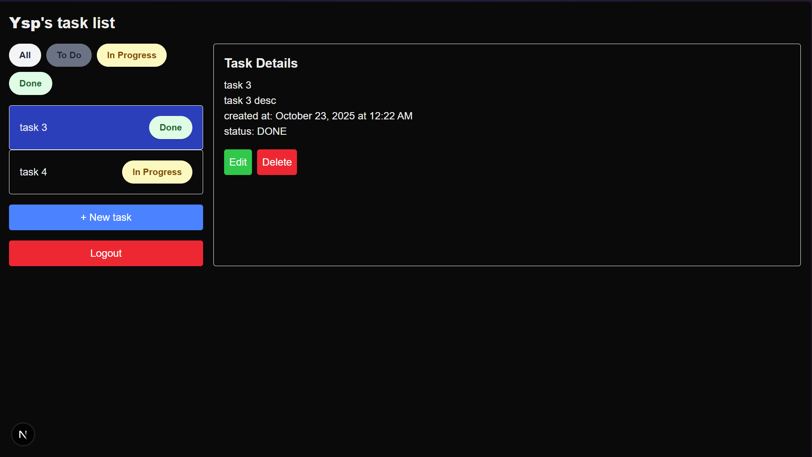
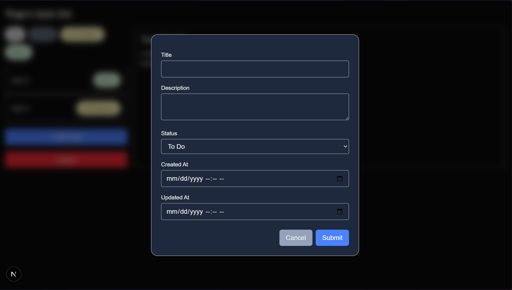
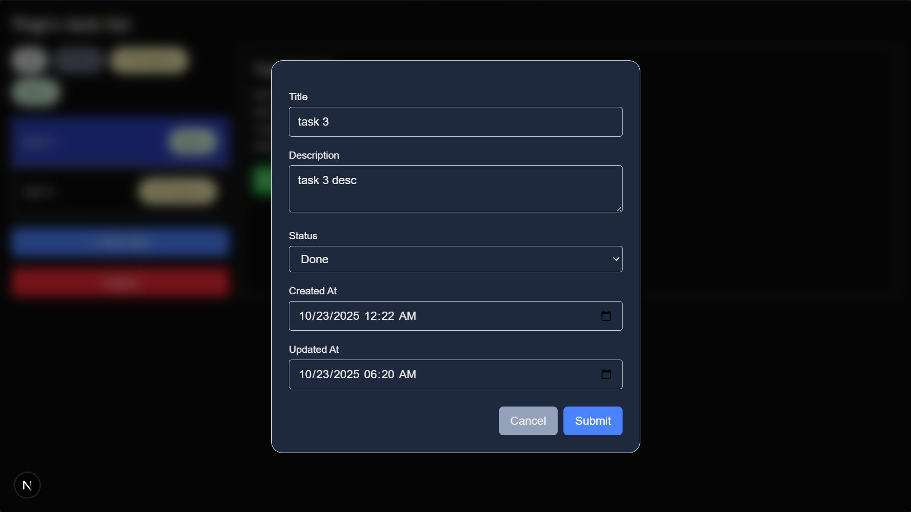
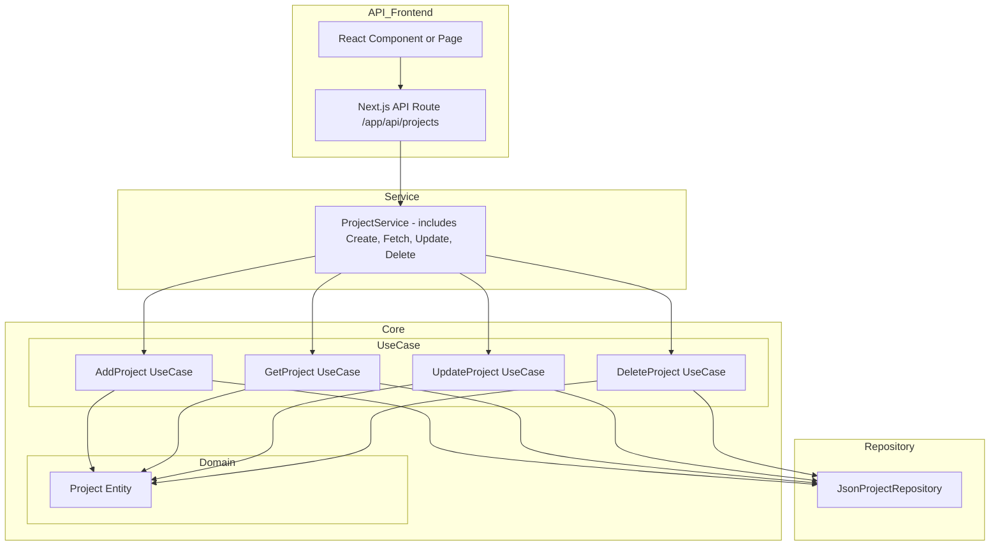

## Features ##
1. Login / Register user
2. Create new task
3. Update status task
4. Filter task by status
5. Delete task

## Screen shots ##
### Login/Register Page

### Task Management Page

## Task Management Module ##

## Run in local ##
### 1. Clone the repository ###
`git clone https://github.com/yosephfernando/nextjs-todo.git`

### 2. Navigate into the project folder ###
`cd nextjs-todo`

### 3. Install dependencies ###
`npm install`

### 4. Start the development server ###
`npm run dev`

## Run test ##
`npm test`

## Example: Project Module (for future implementation) ##
